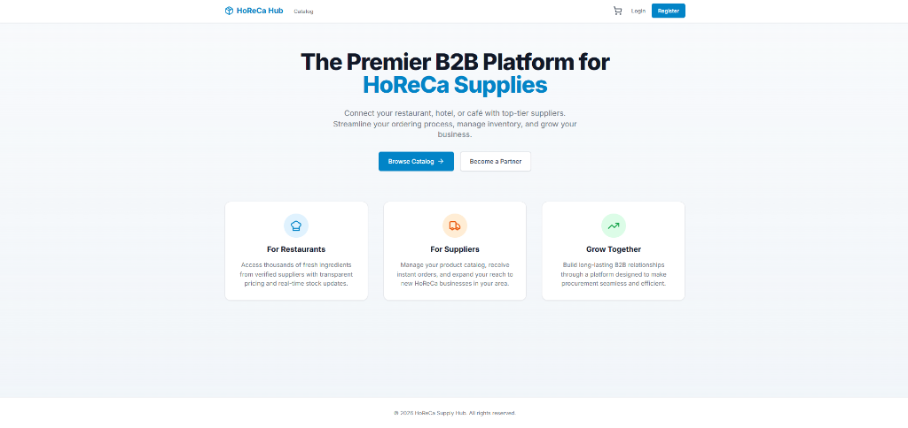
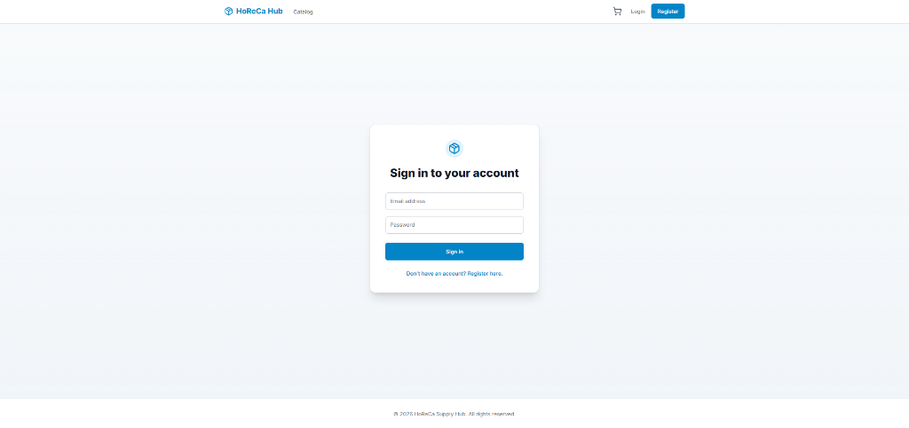
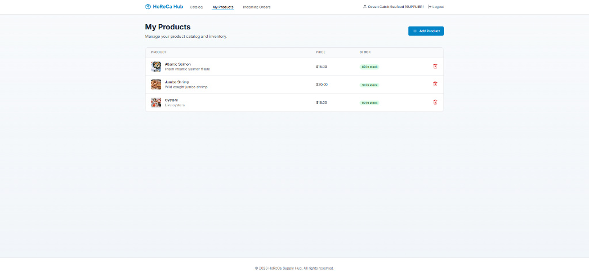
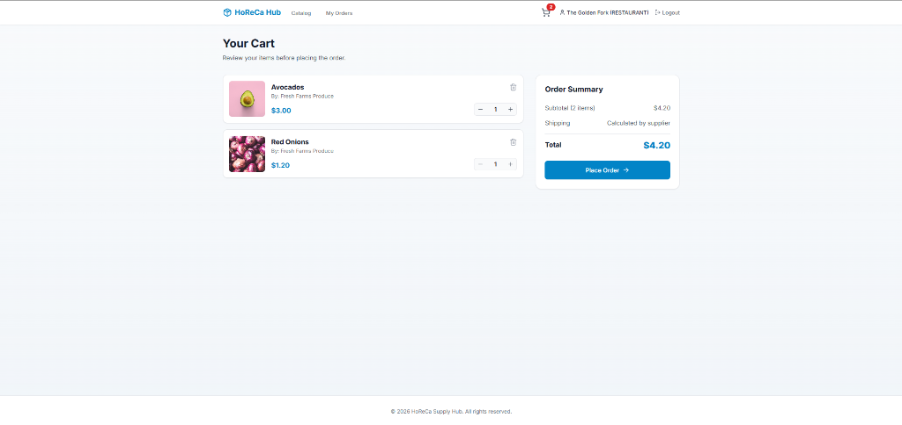
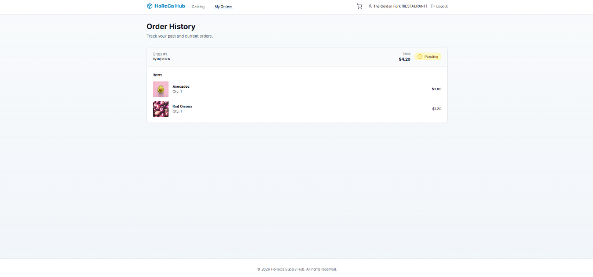

# HoReCa Supply Hub

The Premier B2B Platform for HoReCa Supplies. Connect your restaurant, hotel, or café with top-tier suppliers. Streamline your ordering process, manage inventory, and grow your business.

## Features

- **For Restaurants**: Access thousands of fresh ingredients from verified suppliers with transparent pricing and real-time stock updates.
- **For Suppliers**: Manage your product catalog, receive instant orders, and expand your reach to new HoReCa businesses in your area.
- **Grow Together**: Build long-lasting B2B relationships through a platform designed to make procurement seamless and efficient.

## Screenshots

### Homepage


### Sign In


### Supplier - Product Management


### Shopping Cart


### Order History


## Getting Started

### Prerequisites
- Docker
- Docker Compose

### Running the Application

1. Start all the services using the provided Makefile:
   ```bash
   make up
   ```
2. Initialize and seed the database with sample data:
   ```bash
   make seed
   ```

The application should now be running at `http://localhost`. 

### Managing the Application

To safely stop the application without losing your database:
```bash
make down
```

To stop the application and completely wipe the database volumes:
```bash
make clean
```
*(Note: If you run `make clean`, you will need to run `make seed` again after your next `make up`!)*
